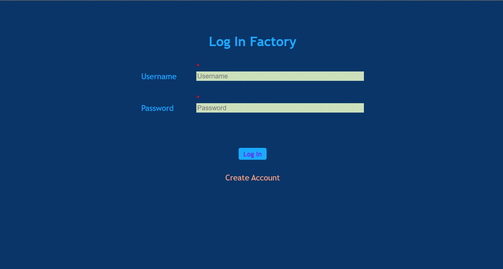
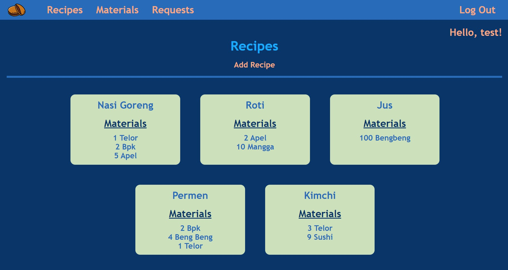

# Mahi Mahi
Kelompok 11 Web Based Development IF3110

## Deskripsi
Web ini merupakan pabrik dari sebuah toko dorayaki, yang menyimpan resep dorayaki beserta bahan baku yang dapat digunakan. Web dibuat dengan menggunakan ReactJS. Pengguna web dapat melakukan login, registrasi, logout, melihat daftar resep, menambahkan resep baru, melihat daftar bahan baku, menambahkan bahan baku baru, memperbaharui stok bahan baku, melihat request dan menerima/menolak request.

## Screenshot
### Login

### Register

### Resep

### Tambah Resep

### Bahan Baku

### Tambah Bahan Baku

### Memperbaharui Stok Bahan Baku

## Pembagian Tugas
Frontend Pabrik Fungsi Login: 13519191
Frontend Pabrik Fungsi Register: 13519015
Frontend Pabrik Fungsi Authenticate: 13519118
Frontend Pabrik Fungsi Get Resep: 13519015
Frontend Pabrik Fungsi Add Resep: 13519118
Frontend Pabrik Fungsi Get Bahan Baku: 13519105
Frontend Pabrik Fungsi Add Bahan Baku: 13519015
Frontend Pabrik Fungsi Edit Bahan Baku: 13519118
Frontend Pabrik Fungsi Get Request: 13519191
Frontend Pabrik Fungsi Accept/Deny Request: 13519191
